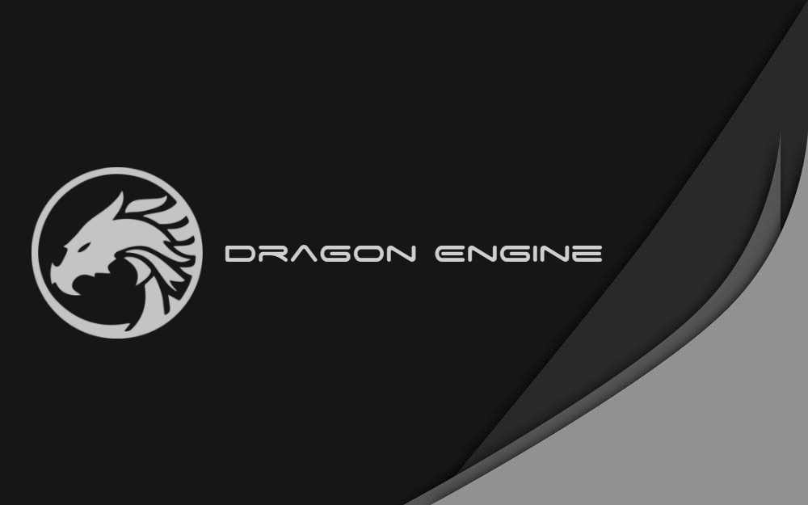

!!! warning "These documentation pages are still a work in progress."
#

Opensource MVC framework for creating your Roblox games

## Overview
Dragon Engine is a singleton-oriented MVC Lua framework designed specificially for Roblox. It bridges the gap between the server and client, globally loads modules to allow for easy communication (this also helps to prevent cyclic requiring), and is designed to serve as the 'backbone' of the game it is in.

## Why Dragon Engine?
Dragon Engine is designed to streamline the operations of your game. Instead of worrying the boilerplate of your game (networking, code communication, etc), the framework takes care of this for you so you can worry about the important stuff.