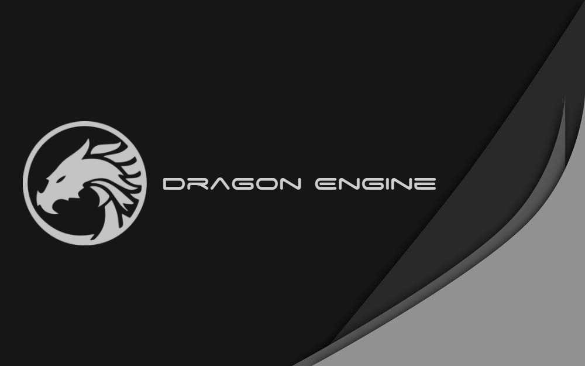

[](https://github.com/NobleDraconian/Dragon-Engine/actions/workflows/lua-lint.yml)

<hr></hr>



# About
Dragon Engine is a Lua framework designed for Roblox. It seamlessly bridges the server/client boundary, unifies modules to allow for easy code communication (this also helps to prevent [cyclic requiring](https://en.wikipedia.org/wiki/Circular_dependency)), and implements a [microservice structure](https://en.wikipedia.org/wiki/Microservices) in your game.

This framework was originally inspired by @Sleitnick's [Aero Game Framework](https://github.com/Sleitnick/AeroGameFramework).

# Installation instructions

## With wally

Dragon Engine can be installed with [wally](https://wally.run/)! Add this to your `wally.toml` file:
```toml
[dependencies]
DragonEngine = "nobledraconian/dragon-engine@2.0.0
```

## Manual installation

Download the `rbxm` file from [the latest release](https://github.com/NobleDraconian/Dragon-Engine/releases/latest). Insert the `rbxm` into `ReplicatedStorage`.
